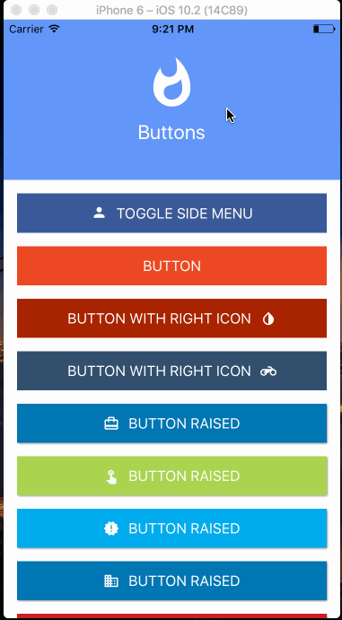

# React Native Elements App

Showcase app for [React Native Elements](https://github.com/react-native-training/react-native-elements) components using Expo.

## Get Started

1. Clone the project

```
git clone https://github.com/react-native-training/react-native-elements-app
```

2. Install dependencies

```
yarn
```

3. Open app with [Expo Desktop Client](https://docs.expo.io/versions/v16.0.0/index.html)
  - If you have never used Expo before, click [here](https://docs.expo.io/versions/v16.0.0/introduction/installation.html) to install it.
  - Then create a new account on the Expo Desktop client that you just installed. Follow [this](https://docs.expo.io/versions/v16.0.0/guides/up-and-running.html#create-an-account) if you need help.
  - Finally click `Project` -> `New Project` and open the folder that you cloned in Step 1 above. Then run the app on simulator or your device.

## Demo:




## Versions:

-  ```"expo": "16.0.0"```

- ```"react": "16.0.0-alpha.6"```

- ```"react-native": "https://github.com/expo/react-native/archive/sdk-16.0.0.tar.gz"```

- ```"react-native-elements": "git://github.com/react-native-training/react-native-elements.git#next"```


## Docs

Click [here](https://react-native-training.github.io/react-native-elements/API/buttons/) to view the docs for React Native Elements.

## TODO:

- [ ] Add [react-navigation](https://github.com/react-community/react-navigation) for navigation
- [ ] Add new components (avatar, badge, divider)
- [ ] Add linter & prettier
- [ ] Update screenshots on Readme
